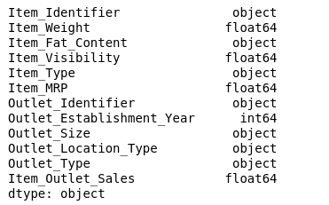

# Item Outlet Sales Predictions

## An analysis of Item Outlet Sales, based upon variety of Item Features

### Rose Tovar

### Objective

This project took a look at Item Outlet Sales and what features could predict the sales numbers. Part 1 of this project was focused around exploring the data by creating data visuzations. The second part was using different machine learning models to find a model that could best fit the data so that predictions could be made.

### Data

The data set that was used for this project is a list of items. Each row includes information regarding the item wieght, visibility, MRP, along with information regarding the Outlet that sells the item in question.

### Methods

Missing Values in numerical columns were imputed with the mean of the column. This was chosen so the mean could be maintained for the column after we imputed missing values. This same philosophy was applied with the nominal columns in how most frequent was chosen in order to maintain the mode.

### Insights

#### Correlation Heatmap

> This correlation heatmap was utilized to find out what numerical features correlated best with the Item outlet sales. When inspecting this heatmap we can see there is a moderate correlation with Item MRP.

#### Item Outlet Sales

> This plot graphed Item MRP vs. Item Outlet Sales hued with the market type. Upon inspection we can see there is 4 linear plots stacked on top of each other based on the outlet type. When all plotted together it creates a triangle shape. As the MRP goes up the range of item outlet sales increases, but the range is dependent on what type of outet we are dealing with.

## Model

The final model recommended for this project is a random forest. It preformed with a 61% Training R2 and 60% testing R2. This implies that this model does have some high bias and is struggling to fit the data. The RMSE preformed within a range of a $1,000 error for item outlet sales. Which does not work that well with some of the data in the set. As some item outlet sales were less than a $1,000.

## Recommendations

Next, Recommendations include looking over the data further and seeing if ordinal encoding would of been a better solution when it comes to Outlet Type and Outlet Size. The reasoning for this suggestion is becauase the size can be seen as being ranked. This also gives the impression that the outlet type may also be in some form of ranking with Grocery, Type 1, Type 2 and Type 3. This would require talking to someone with more knowledge of the dataset, and finding out what the key differences about the outlet types are.

## Limitations & Next Steps

The biggest Limitation of this project would be not having a dataset expert to consult regarding the project about the outlet types and sizes.

Once a data expert has been consulted, the next steps would be to re-run the model with the adjusts made for features that are ordinal and see if that improves performance.
