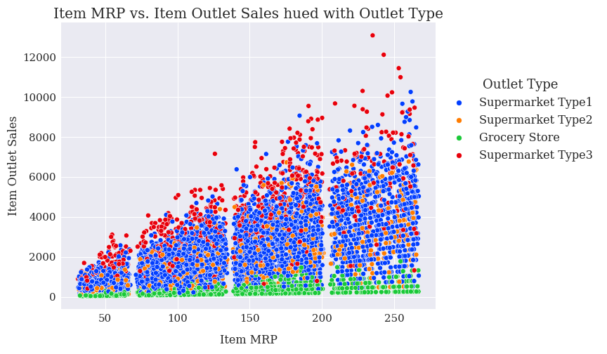

# Item Outlet Sales Predictions

## An analysis of sales predictions based on different features related to the items.

### Rose Tovar

### Data

The data set that was used for this project is a list of items. Each row includes information regarding the item wieght, visibility, MRP, along with information regarding the Outlet that sells the item in question.

### Methods

Missing Values in numerical columns were imputed with the mean so that the columns overall mean was maintained after imputation. This philosophy was used with the nominal columns in how we used most frequent so that the mode was maintained.

### Insights

#### Correlation Heatmap

> We conducted a correlation heatmap to find out what numerical features correlated best with the Item outlet sales. When inspecting this heatmap we can see there is a moderate correlation with Item MRP.

#### Item Outlet Sales

> This plot graphed Item MRP vs. Item Outlet Sales hued with the market type. What i find interesting in this plot is that there seems to 4 linear plots stacked on top of each other based on the market type and their outlet sales when compared to MRP. When all plotted together it creates a triangle shape As the MRP goes up the range of outlet sales increases. But the range is dependent on what type of outet we are dealing with.

## Model

The final model i recommend for this project is a random forest. It preformed with a 61% Training R2 and 60% testing R2. This implies that this model does have some high bias and is struggling with fit with the data. The RMSE preformed within a range of a 1000$ error for item outlet sales. Which does not work that well with some of the data in the set. As some item outlet sales were less than a 1000$.

## Recommendations

Next Recommendations include looking over the data further and seeing if Oridinal Encoding would of been a better solution when it comes to Outlet Type and Outlet Size. My reasoning for this is becauase the Size is in a ranking of sorts of Small Medium, and Large. And i am under the impression that the outlet type may also be in some form of ranking with Grocery, Type 1, Type 2 and Type 3. This would require talking to someone with more knowledge of the dataset and finding out what the key differences about the outlet types are and if they could ordinal encoded.

## Limitations & Next Steps

The biggest Limitation of this project would be not having a dataset expert to consult regarding the project about the outlet types and sizes.
